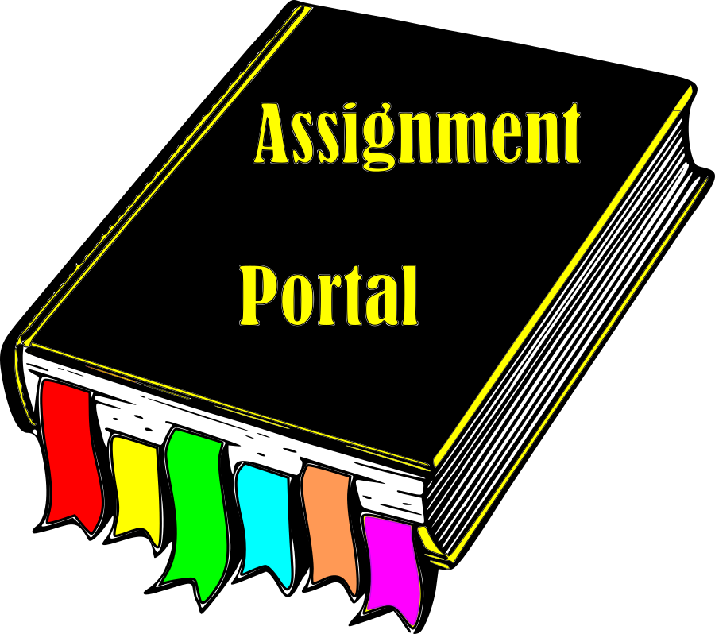
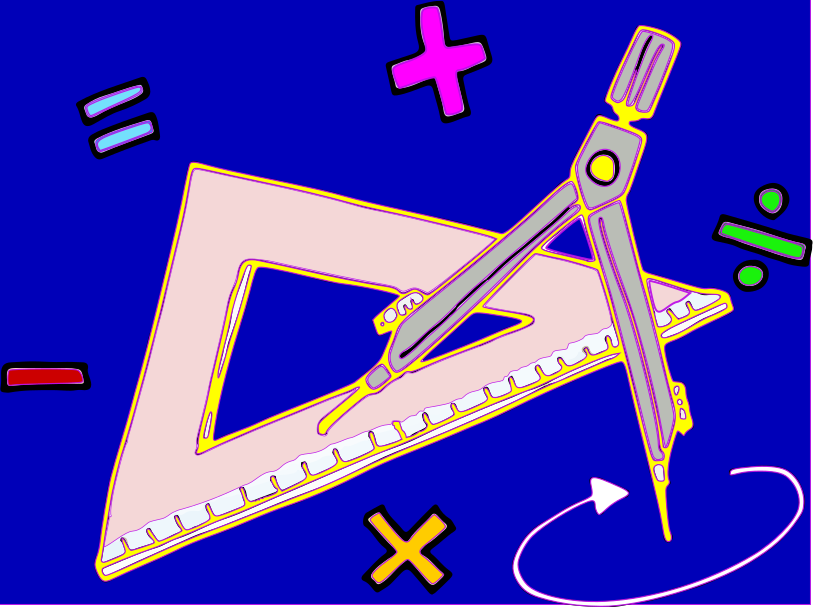
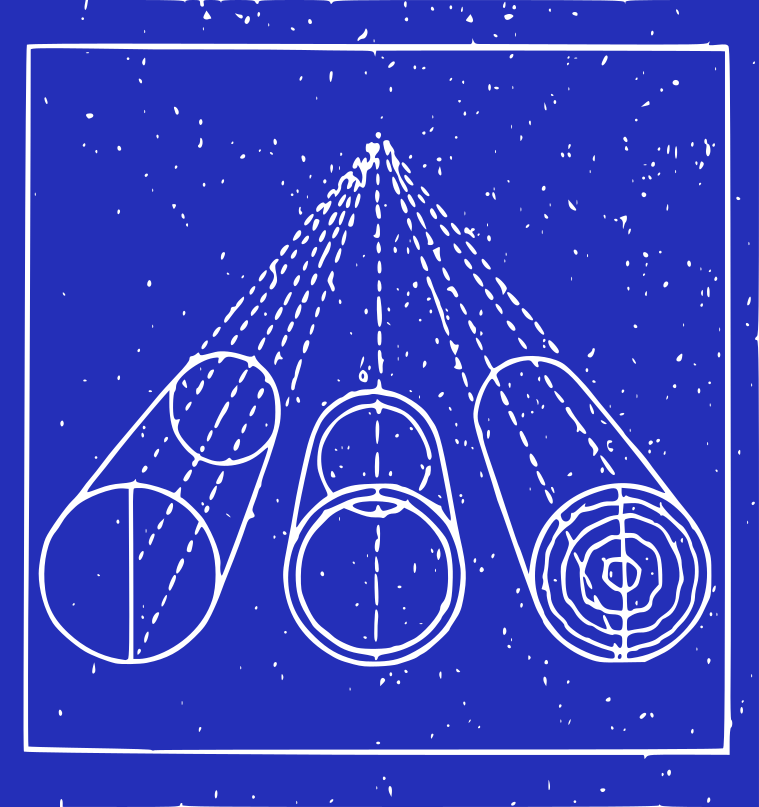
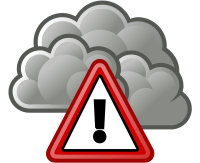
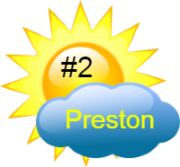
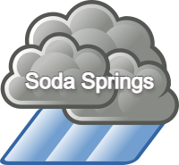
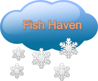

### &nbsp; Assignment Portal Direct Link: &nbsp;|&emsp; Principles of Design Link:&emsp; |&nbsp; &emsp; Website Plan Link:

###### &emsp; &nbsp; &emsp; &emsp; &nbsp; &nbsp; &nbsp; (click on icon below) &nbsp; &nbsp; &nbsp; &nbsp; &emsp; &emsp; &nbsp; &nbsp; &nbsp; &nbsp; &emsp; &nbsp; &emsp; &emsp; &nbsp; (click on icon below) &nbsp; &nbsp; &emsp; &emsp; &nbsp; &nbsp; &nbsp; &nbsp; &emsp; &emsp; &emsp; &nbsp; (click on icon below)                                                              

&emsp; &emsp; &nbsp; &nbsp;
&nbsp; &emsp; &nbsp; &emsp; &emsp; &nbsp; 
&nbsp; &nbsp; &emsp; &emsp; 
        
### &nbsp; #1 Weather Site Preston Link: &nbsp; | &nbsp;Weather Site Gallery Pg Link: &nbsp;|&nbsp; &emsp; Lazy Loading Link:
           
###### &emsp; &nbsp; &emsp; &emsp; &emsp; (click on icon below) &emsp; &emsp; &nbsp; &nbsp; &emsp; &nbsp; &emsp; &emsp; &nbsp; &nbsp; &nbsp; &emsp; &emsp; (click on icon below) &emsp; &nbsp; &nbsp; &emsp; &emsp; &nbsp; &nbsp; &nbsp; &emsp; &emsp; &emsp; (click on icon below)    

&emsp; &emsp;
&emsp; &emsp; &emsp; &emsp; &emsp;  
&emsp; &emsp; &emsp; 

### &nbsp; &emsp; &nbsp;Storm Center Pg Link: &nbsp; &emsp; &nbsp;|&nbsp; Form Completion Thanks Link: &nbsp;| &emsp; JSON & fetch Link:

###### &emsp; &nbsp; &emsp; &emsp; &emsp; (click on icon below) &emsp; &emsp; &nbsp; &nbsp; &emsp; &nbsp; &emsp; &emsp; &nbsp; &nbsp; &nbsp; &emsp; &emsp; (click on icon below) &emsp; &nbsp; &nbsp; &emsp; &emsp; &nbsp; &nbsp; &nbsp; &emsp; &emsp; &emsp; (click on icon below)

&emsp; &emsp;
&emsp; &emsp; &emsp; &emsp; &nbsp; 
&nbsp;&emsp; &emsp; &emsp; &nbsp; 

### &nbsp; &nbsp; Weather Site Home Pg Link: &nbsp;| &nbsp; #2 Weather Site Preston Link: &nbsp;|&nbsp; &nbsp; Soda Springs Pg Link:

###### &emsp; &nbsp; &emsp; &emsp; &emsp; (click on icon below)&emsp; &emsp; &nbsp; &nbsp; &emsp; &nbsp; &emsp; &emsp; &nbsp; &nbsp; &nbsp; &emsp; &emsp; &nbsp; &nbsp;(click on icon below) &emsp; &nbsp; &nbsp; &emsp; &emsp; &nbsp; &nbsp; &nbsp; &emsp; &emsp; &emsp;(click on icon below) 

&emsp; &emsp;
&emsp; &emsp; &emsp; &emsp; &emsp;
&nbsp;&emsp; &emsp; &emsp; &nbsp;

### &nbsp; &nbsp; &emsp; &nbsp;Fish Haven Pg Link: &nbsp; &emsp; &nbsp; | &nbsp; &emsp; &emsp; &nbsp; &nbsp; &emsp; &nbsp; &emsp; &emsp; Scoots Website Link

###### &emsp; &nbsp; &emsp; &emsp; &emsp; (click on icon below) &emsp; &emsp; &nbsp; &nbsp; &nbsp; &emsp; &emsp; &nbsp; &nbsp;(click on icon below) &emsp; &nbsp; &nbsp; &emsp; &emsp; &nbsp; &nbsp; &nbsp; &emsp; &emsp; &emsp;(click on icon below) 

&emsp; &emsp;
&emsp; &emsp; &emsp; &emsp; &emsp;
